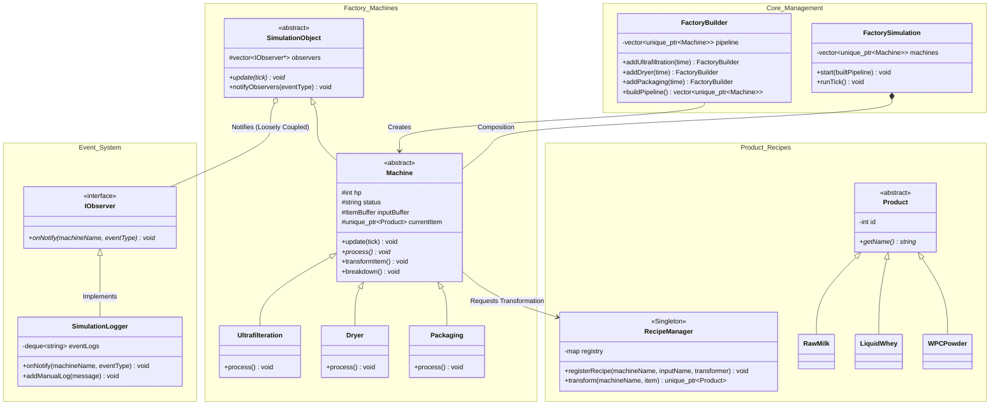

# WPC (Whey Protein Concentrate) Factory Simulation

OOP with C++ | GIST EECS

## 1. Project Overview

This project is an interactive factory automation simulation implemented using modern C++ Object-Oriented Programming (OOP). We selected the Whey Protein Concentrate (WPC) manufacturing process as our target domain. Through an intuitive GUI built with Dear ImGui, users can control and monitor the production flow and the real-time status of the machines.

This simulation is fundamentally architected around the four core principles of OOP (Abstraction, Encapsulation, Inheritance, Polymorphism) and strictly adheres to the **Open-Closed Principle (OCP)**. By completely decoupling the UI from the backend business logic and utilizing advanced design patterns, it ensures high memory safety, maintainability, and scalability within a highly interactive system.

---

## 2. Core OOP Architecture (Design Justification)

### 1) Polymorphism & Abstract Hierarchy
- The base class `Machine` inherits from `SimulationObject`. The main simulation loop (`FactorySimulation::runTick()`) iterates over an array of base class smart pointers (`std::unique_ptr<Machine>`) and polymorphically calls `m->update(tick)`. The system operates entirely without the need for `if/else` branching or `dynamic_cast` to identify the concrete type of each machine (`Ultrafilteration`, `Dryer`, `Packaging`).

### 2) Strict Encapsulation
- Internal state variables of the `Machine` and `ItemBuffer` classes (such as `status`, `hp`, `processingTime`, and queues) are strictly restricted to `private` or `protected`. There are exactly **zero public data members** accessible to a code reviewer. State changes are strictly driven through encapsulated interface methods ensuring complete data integrity.

### 3) Memory Safety (Modern C++)
- The entire pipeline and inventory system were refactored using `std::unique_ptr`. The `ItemBuffer` safely moves `unique_ptr<Product>`, preventing any memory leaks during high-speed simulations, forced breakdowns, or pipeline resets. 

### 4) UI & Backend Decoupling (MVC Approach)
- The backend core classes do not contain a single line of Dear ImGui-related headers. We completely eliminated intermediate controller classes by introducing `SimulationBridge.h`. The UI strictly reads pure data structs (`MachineSnapshot`) and dispatches pure action requests (`SimulationCommand`). This ensures a 100% decoupled MVC architecture where the View and the Model are entirely oblivious to each other's implementation.

---

## 3. Advanced Design Patterns

To ensure maximum scalability and compliance with the OCP, we implemented several advanced design patterns:

### 1) **Observer Pattern (Event System):** 
An `IObserver` interface was introduced. The `SimulationLogger` subscribes to machines, which broadcast decoupled notifications (e.g., `"BREAKDOWN"`, `"BREAKDOWN_ITEM_LOST"`) without knowing how the logs are rendered.

### 2) **Singleton & Strategy (RecipeManager):** 
To completely decouple machine logic from specific products, we introduced a `RecipeManager`. It registers functional transformation rules (`TransformerFunc`) at runtime. Machines no longer hardcode output types; they simply request a transformation (`transformItem()`).

### 3) **Builder Pattern (Pipeline Construction):** 
The `FactoryBuilder` provides a fluent interface (`addUltrafiltration(3).addDryer(7)...`) to dynamically construct, link (`setNextMachine`), and inject the machine pipeline into the simulation without modifying the core engine.

---

## 4. Factory Domain Scenario

The simulation processes `Raw Milk` into a finished `WPC Powder` product through a three-stage pipeline.

### 1) Ultrafiltration (Stage 1)
* **Input/Output:** Raw Milk -> Liquid Whey
* **Role:** Filters out water and lactose to concentrate the protein (Processing time: 3 Ticks).
* **Feature:** Prone to intermittent breakdowns (Breakdown probability: 1.0%).

### 2) Spray Dryer - Bottleneck (Stage 2)
* **Input/Output:** Liquid Whey -> WPC Powder
* **Role:** Sprays hot air onto the concentrate to convert it into powder (Processing time: 7 Ticks).
* **Feature:** Induces a natural bottleneck due to the longest processing time. It has the highest breakdown probability (2.4%) due to temperature sensor wear.

### 3) Packaging (Stage 3)
* **Input/Output:** WPC Powder -> (Finished Good)
* **Role:** Seals the powder into commercial containers (Processing time: 2 Ticks).
* **Feature:** The fastest and most stable process (Breakdown probability: 0.6%).

---

## 5. Simulation Scenarios

Users can switch between the following scenarios in real-time via the ImGui dropdown menu:

### 1) **Normal Flow:** The pipeline runs at its default speed. Due to the differences in processing times (3 -> 7 -> 2), users can observe a realistic bottleneck where WIP (Work-In-Progress) accumulates in front of the Dryer.

### 2) **Random Breakdowns (Overflow & Product Loss):** The dynamic breakdown probability activates. Machines take damage every tick they operate and eventually shut down (`status = "BROKEN"`). Crucially, any WIP item inside a breaking machine is permanently lost, triggering a `BREAKDOWN_ITEM_LOST` event and forcing operators to monitor queue overflows.

---

## 6. ImGui User Interface Features

### 1) **Simulation Control:** 
Start, Pause, Reset buttons; Speed slider (1x-5x); Scenario selector dropdown.

### 2) **Factory Floor:** 
Displays real-time status (`WORKING`, `BROKEN`, `IDLE`) of all machines using color-coded text, cleanly driven by backend `MachineSnapshot` structs.

### 3) **Inspector:** 
Displays detailed machine telemetry (HP bar, Progress bar, Current Item, Queue Size). Administrators can intervene using **Force Break** and **Instant Repair** commands.

### 4) **Event Log:** 
Powered by the Observer pattern, it records all state changes, product losses, and repairs with timestamps in a scrollable view.

### 5) **Statistics:** 
Real-time tracking of Finished Goods, WIP count, Total Breakdowns, and **Lost Products**.

---

## 7. Class Diagram (UML)

## 8. How to Build & Run

### 1) Clone this repository
git clone <your-repository-url>
cd <repository-folder>

### 2) Build using CMake (Command Line / Developer Command Prompt)
mkdir build
cd build
cmake ..
cmake --build . --config Release

### 3) Run the executable
./Release/FactorySimulation.exe
